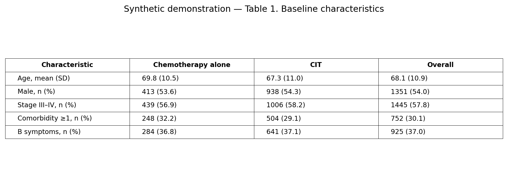
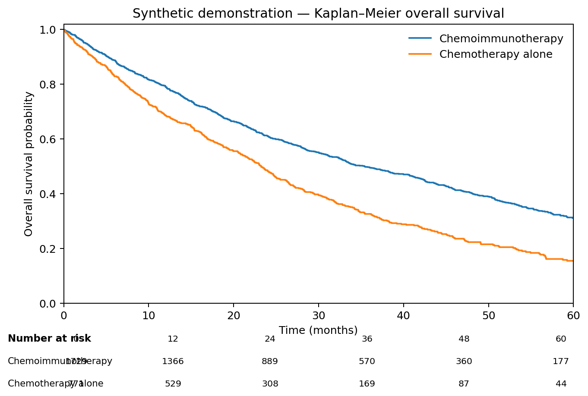
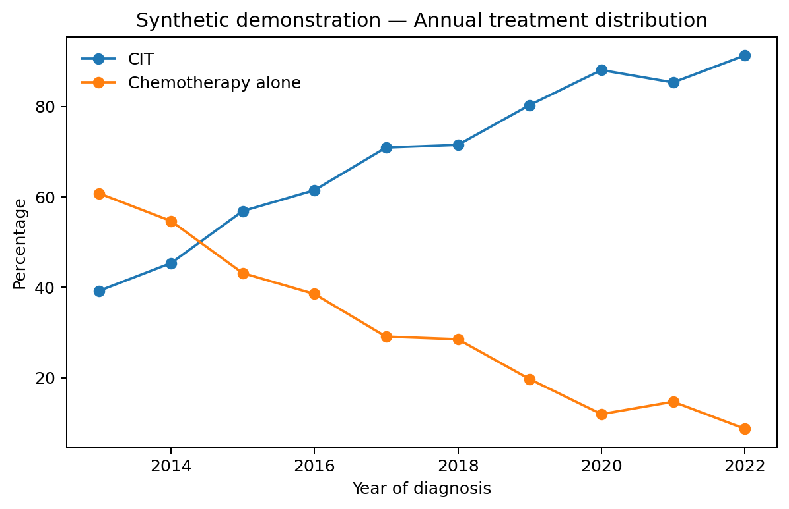
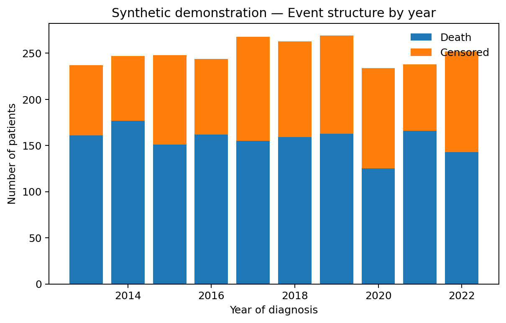
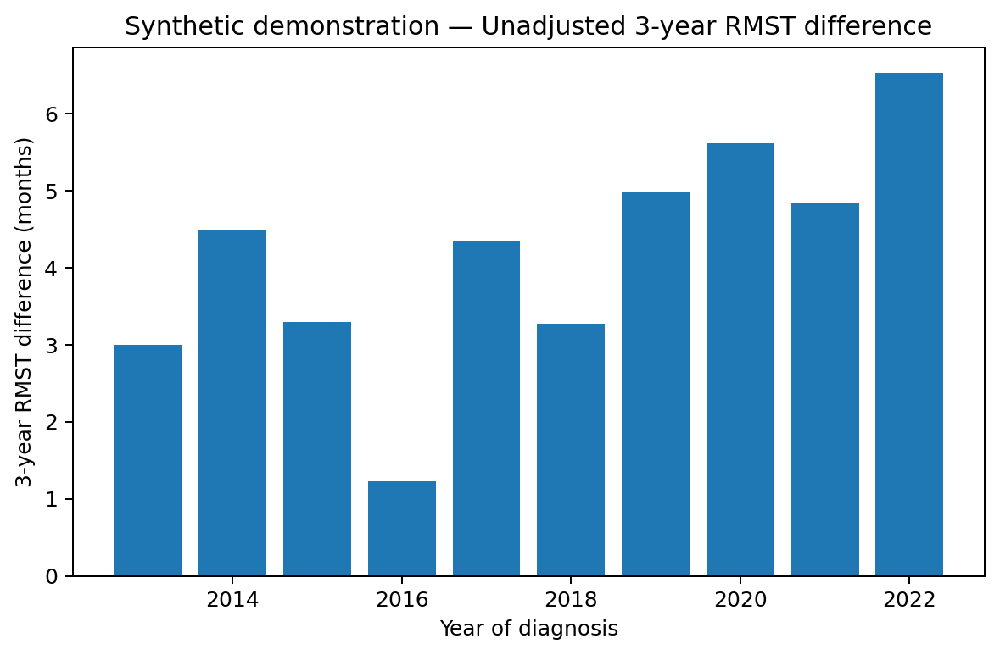
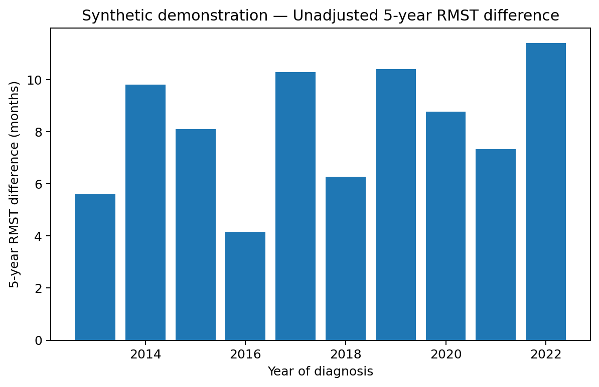
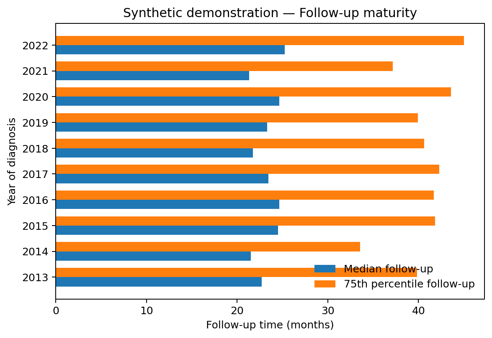
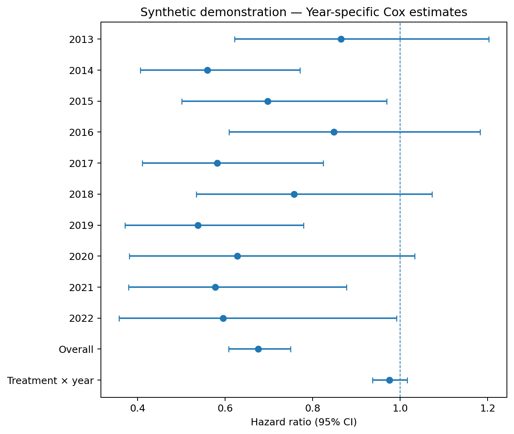

# Real-World Chemoimmunotherapy Use and Survival in Diffuse Large B-Cell Lymphoma

### A reproducible survival-analysis portfolio project based on a previously conducted clinical research project

## Project purpose

This repository is an **educational and reproducibility-focused reconstruction** based on a DLBCL clinical research project in which I participated as an undergraduate researcher. The original project evaluated changes in chemoimmunotherapy (CIT) use and overall survival in the National Cancer Database (NCDB) from 2013–2022.

**No restricted NCDB patient-level data, original study code, proprietary files, or unpublished study figures are included here.**  
All demonstration data and figures in this repository are **synthetic** and are used only to illustrate the statistical workflow.

## Original clinical questions

1. How did the use of chemoimmunotherapy versus chemotherapy alone change from 2013–2022?
2. Was chemoimmunotherapy associated with better overall survival?
3. Did the magnitude of the survival association change across calendar years?
4. Were the findings robust to a 30-day landmark sensitivity analysis?

## Statistical workflow demonstrated

1. Baseline characteristics / Table 1
2. Annual treatment distribution
3. Kaplan–Meier survival analysis with number at risk
4. Event structure by diagnosis year
5. Multivariable Cox proportional hazards regression
6. Treatment-by-calendar-year interaction
7. Restricted mean survival time (RMST) concept
8. Follow-up maturity
9. 30-day landmark sensitivity analysis
10. Clinical interpretation of adjusted associations

## Important note about RMST

The original project used **year-specific adjusted RMST differences at 36 and 60 months**. The public materials available to this portfolio do not fully specify the exact covariate-adjustment estimator.

Therefore, this public portfolio shows only an **unadjusted RMST concept demonstration using synthetic data**. It should not be interpreted as a reproduction of the original adjusted RMST analysis.

## Demonstration outputs

### Table 1 — Baseline characteristics

### Kaplan–Meier overall survival with number at risk

### Annual treatment distribution

### Event structure by diagnosis year

### 3-year RMST difference by diagnosis year

### 5-year RMST difference by diagnosis year

### Follow-up maturity

### Year-specific Cox estimates and treatment-by-year interaction

### Primary vs 30-day landmark sensitivity analysis

## What this project demonstrates

This project is intended to demonstrate my ability to connect:

**clinical question → observational study design → descriptive analysis → survival modeling → sensitivity analysis → clinical interpretation**

The goal is not to claim independent reproduction of the original NCDB study. It is to demonstrate a transparent, reproducible clinical-biostatistics workflow based on research methods I have previously studied and used.

## Tools

- Python
- pandas / NumPy
- matplotlib
- statsmodels
- Jupyter Notebook

## Author

Haibo (Bobby) Cheng  
Virginia Tech  
B.S. Industrial and Systems Engineering | Minor in Statistics
