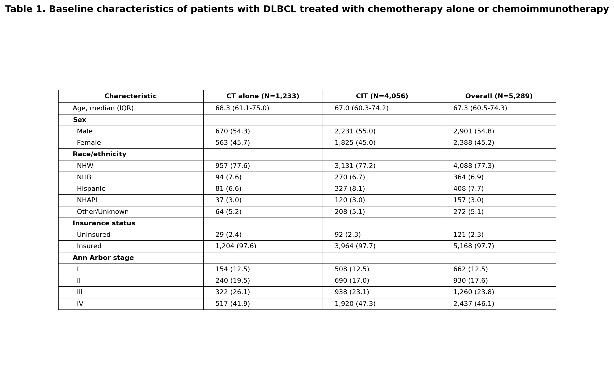
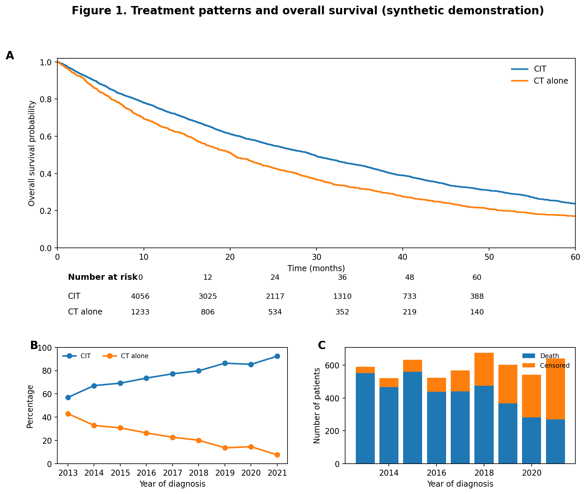
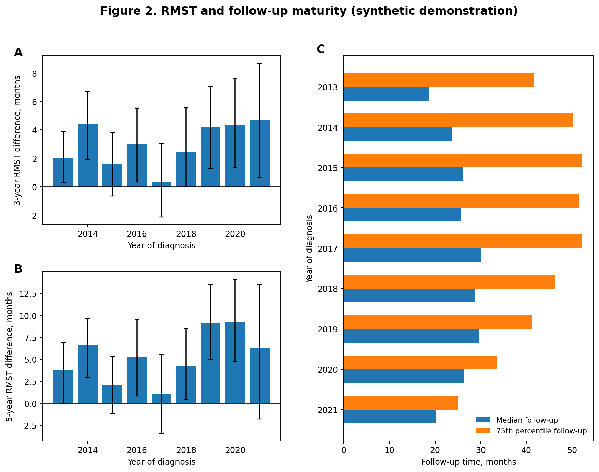
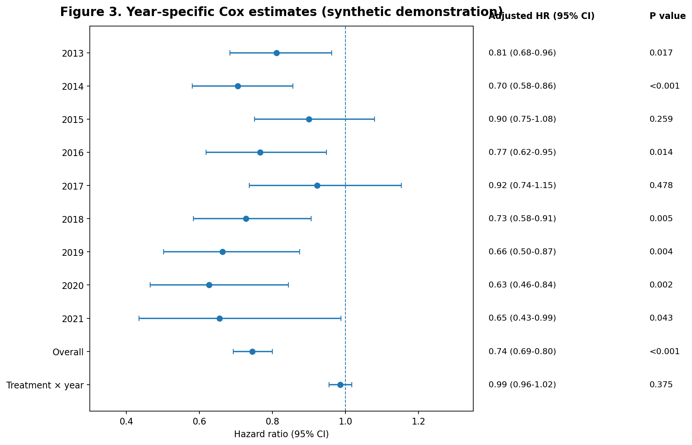
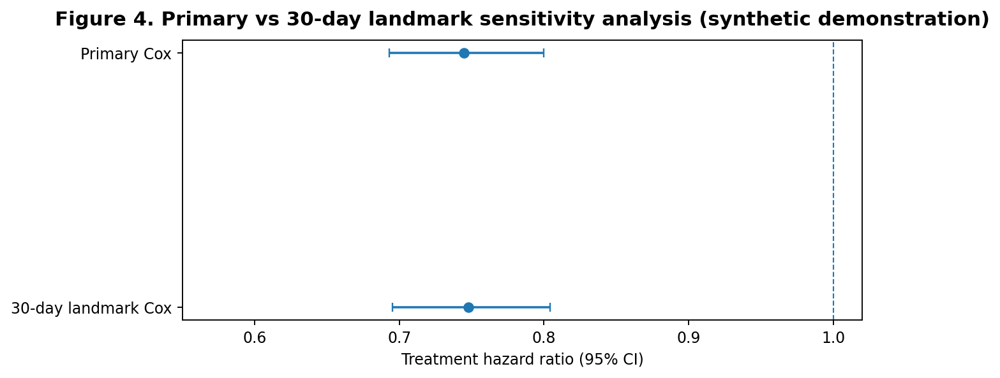

# Real-World Chemoimmunotherapy Use and Survival in Diffuse Large B-Cell Lymphoma

### A reproducible survival-analysis portfolio project based on a previously conducted clinical research project

## Project purpose

This repository is an **educational and reproducibility-focused reconstruction** based on a DLBCL clinical research project in which I participated as an undergraduate researcher. The original project evaluated changes in chemoimmunotherapy (CIT) use and overall survival in the National Cancer Database (NCDB).

**No restricted NCDB patient-level data, proprietary team code, or unpublished team figures are included here.**  
All data and results displayed below are **synthetic demonstration outputs** created only to show the statistical workflow and interpretation structure.

## Relationship to the original project

- **Original study period:** 2013–2022  
- **Public synthetic demonstration years shown in figures:** 2013–2021  
- **Exposure:** Chemoimmunotherapy vs chemotherapy alone  
- **Primary outcome:** Overall survival  
- **Key methods demonstrated:** descriptive analysis, Kaplan–Meier analysis, Cox regression, treatment-by-year interaction, RMST interpretation, and 30-day landmark sensitivity analysis

## Demonstration outputs

### Table 1 — Baseline characteristics

### Figure 1 — Treatment patterns and overall survival

### Figure 2 — RMST and follow-up maturity

### Figure 3 — Year-specific Cox estimates

### Figure 4 — Primary vs 30-day landmark sensitivity analysis

## What this project demonstrates

This portfolio is designed to show that I can connect:

**clinical question → observational design → descriptive analysis → survival analysis → sensitivity analysis → interpretation**

The goal is **not** to claim direct reproduction of the original NCDB study. The goal is to present a clear and professionally organized public-facing demonstration of the statistical workflow that I used and studied in prior collaborative research.

## Tools

- Python
- pandas / NumPy
- matplotlib
- statsmodels
- Jupyter Notebook

## Author

Haibo (Bobby) Cheng  
Virginia Tech  
B.S. Industrial and Systems Engineering | Minor in Statistics
