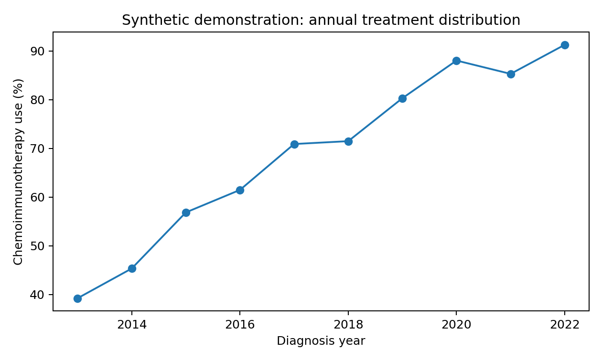
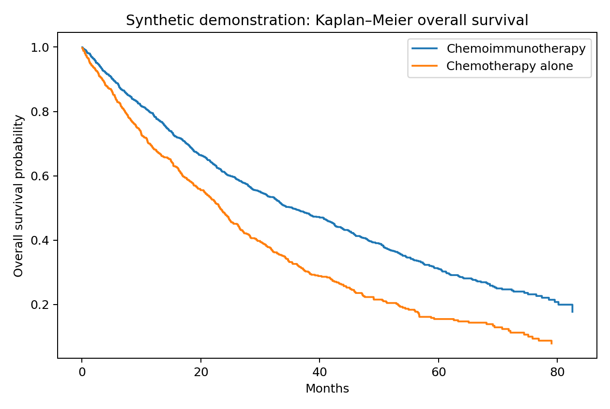
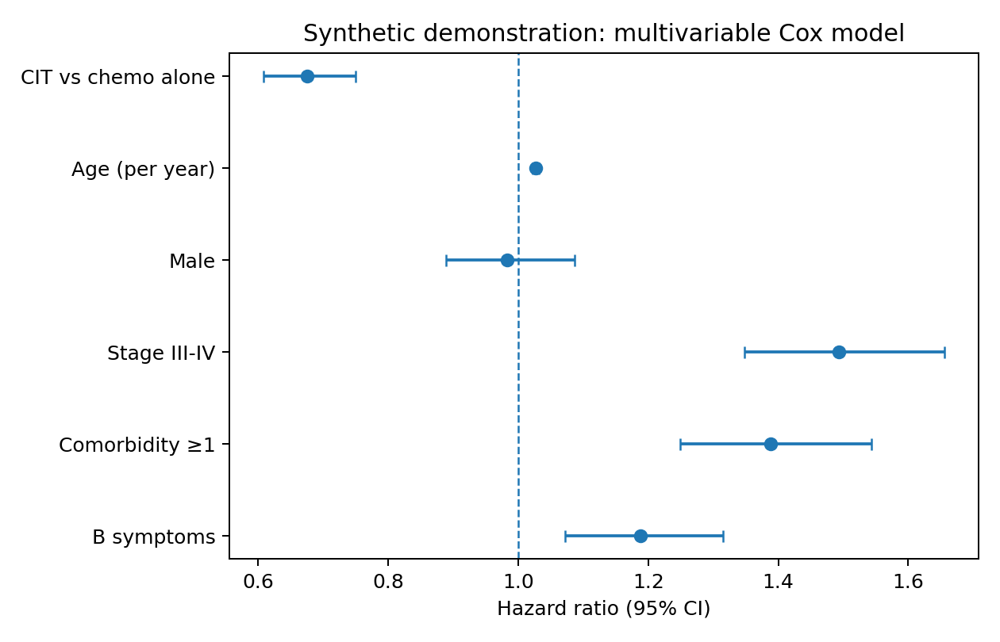
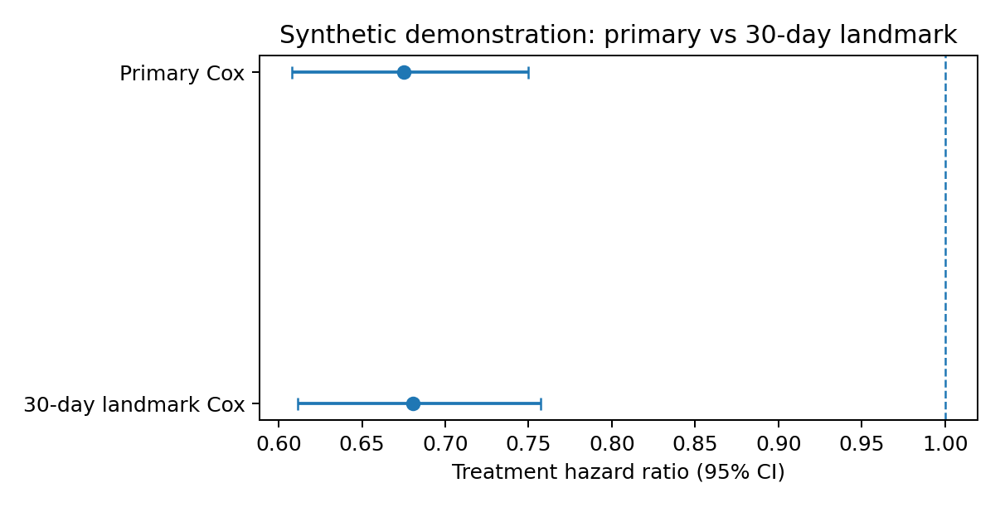

# Real-World Chemoimmunotherapy Use and Survival in Diffuse Large B-Cell Lymphoma

### A reproducible survival-analysis portfolio project based on a previously conducted clinical research project

## Project purpose

This repository is an **educational and reproducibility-focused reconstruction** based on a DLBCL clinical research project in which I participated as an undergraduate researcher. The original project evaluated changes in chemoimmunotherapy (CIT) use and overall survival in the National Cancer Database (NCDB) from 2013–2022.

**No restricted NCDB patient-level data, original study code, or proprietary files are included here.**  
The repository uses a **synthetic demonstration dataset** only to show the statistical workflow.

## Original clinical question

Among patients with diffuse large B-cell lymphoma (DLBCL):

1. How did the use of chemoimmunotherapy versus chemotherapy alone change from 2013–2022?
2. Was chemoimmunotherapy associated with better overall survival?
3. Did the magnitude of the survival association change across calendar years?
4. Were the findings robust to a 30-day landmark sensitivity analysis?

## Study framework from the original project

- **Design:** Retrospective cohort study
- **Original data source:** National Cancer Database (NCDB)
- **Study period:** 2013–2022
- **Exposure:** First-course chemoimmunotherapy vs chemotherapy alone
- **Primary outcome:** Overall survival
- **Covariates described in the project:** age, sex, race/ethnicity, stage, comorbidity, B symptoms, insurance, income, education, urbanicity, and facility type
- **Sensitivity analysis:** 30-day landmark analysis

## Statistical workflow demonstrated

1. Annual treatment distribution
2. Baseline descriptive analysis / Table 1
3. Kaplan–Meier survival analysis
4. Multivariable Cox proportional hazards regression
5. Treatment-by-calendar-year interaction
6. Restricted mean survival time (RMST)
7. 30-day landmark sensitivity analysis
8. Clinical interpretation of adjusted associations

## Important note about RMST

The original project materials specify **year-specific adjusted RMST differences at 36 and 60 months**, but the presentation does not fully specify the exact computational estimator used for covariate adjustment.

For that reason, this public portfolio repository includes only an **unadjusted RMST demonstration** with synthetic data. I do not claim that this reproduces the original adjusted RMST estimator. A faithful adjusted-RMST implementation should be added only after aligning with the original analysis code or statistical specification.

## Repository structure

```text
Haibo_GitHub_Project1_DLBCL_CIT/
├── README.md
├── PROJECT_PROTOCOL.md
├── METHODS_I_CAN_EXPLAIN.md
├── requirements.txt
├── data/
│   └── synthetic_dlbcl_demo.csv
├── notebooks/
│   ├── 01_treatment_patterns.ipynb
│   ├── 02_km_and_cox.ipynb
│   ├── 03_treatment_year_interaction.ipynb
│   ├── 04_landmark_sensitivity.ipynb
│   └── 05_rmst_concept_demo.ipynb
├── src/
│   └── generate_synthetic_data.py
├── tables/
└── figures/
```

## Demonstration outputs

### Annual treatment use


### Kaplan–Meier overall survival


### Multivariable Cox model


### Primary vs 30-day landmark analysis


## What this project demonstrates

This project is intended to demonstrate my ability to connect:

**clinical question → observational study design → survival analysis → sensitivity analysis → clinical interpretation**

The goal is not to claim independent reproduction of the original NCDB study or to optimize predictive performance. The goal is to demonstrate a transparent, reproducible clinical biostatistics workflow based on research methods I have previously studied and used.

## Tools

- Python
- pandas / NumPy
- matplotlib
- statsmodels
- Jupyter Notebook

## Author

Haibo (Bobby) Cheng  
Virginia Tech  
B.S. Industrial and Systems Engineering | Minor in Statistics
